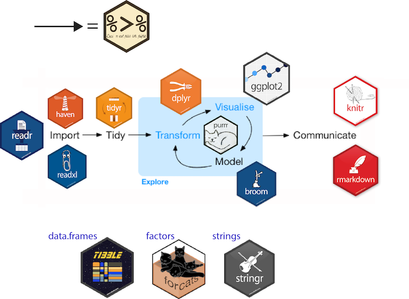

```{r setup, include=FALSE}
options(htmltools.dir.version = FALSE)
knitr::opts_chunk$set(echo = TRUE, fig.width = 5, fig.height = 3, dpi = 300)


```

```{r xaringan-themer, include = FALSE}
library(xaringanthemer)
mono_accent(
  base_color = "#0084A1",
  header_font_google = google_font("Raleway"),
  text_font_google = google_font("Raleway", "300", "300i"),
  code_font_google = google_font("Fira Code"),
  text_font_size = "22px"
)
```

class: center, middle

# Data visualization
---

## Data visualization

> *"The simple graph has brought more information to the data analyst’s mind than any other device."  
> — John Tukey*

- Data visualization is the creation and study of the visual representation of data.
- Many tools for visualizing data (R is one of them)
- Many approaches/systems within R for making data visualizations, **ggplot2** is one of them

---

## ggplot2 $\in$ tidyverse

.pull-left[
```{r echo=FALSE, out.width="80%"}
knitr::include_graphics("./img/ggplot2-part-of-tidyverse.png")
```
]
.pull-right[
- **ggplot2**: tidyverse's data visualization package
- `gg` in "ggplot2" stands for Grammar of Graphics
- Inspired by the book **Grammar of Graphics** by Leland Wilkinson
- A grammar of graphics is a tool that enables concise description of components of a graphic


```{r echo=FALSE, out.width="80%"}
knitr::include_graphics("./img/grammar-of-graphics.png")
```
]

---


## ggplot2 $\in$ tidyverse

.pull-left[
```{r echo=FALSE, out.width="100%"}
knitr::include_graphics("./img/tidy-workflow.png")
```
]


.pull-right[
```{r echo=FALSE, out.width="90%"}

```
]

---


## Following along...

- Download the materials at and launch `ggplot2.Rproj`
- Install `tidyverse` if you haven't done so before, or if you haven't updated it recently
```{r, message=FALSE, eval=FALSE}
install.packages("tidyverse")
install.packages("ggrepel")
install.packages("plotly")
devtools::install_github("thomasp85/patchwork")
```
- Load libraries

```{r, message=FALSE}
library(tidyverse)
library(ggrepel)
library(plotly)
library(patchwork)
```
- Open `ggplot2.Rmd` to follow along in markdown document

---


## Dataset

[Stanford Open Policing Project](https://openpolicing.stanford.edu/)


[Police Searches Drop Dramatically in States that Legalized Marijuana](https://www.nbcnews.com/news/us-news/police-searches-drop-dramatically-states-legalized-marijuana-n776146)

* Police Stop Data
  - state, driver race, stop rate, marijuana legalization status

```{r, message=FALSE, eval=TRUE} 

stops <- read_csv("../data/opp-search-marijuana_state.csv") %>% 
  filter(state %in% c("WA", "CO")) %>% 
  mutate(legalization_status = ifelse(quarter <= "2013-01-01", "pre","post"),
         search_rate_100 = search_rate * 100) 

```


---
class: center, middle

# Layer up!
---
 

```{r echo=FALSE, eval= TRUE, out.width="100%"}
wa_plot <- stops %>% filter(state == "WA") %>% 
  ggplot(aes(x = quarter , y = search_rate_100, color = driver_race, group = interaction(legalization_status, driver_race))) + 
  geom_point(size = 2) + 
  stat_smooth(method = lm , se = FALSE) +
  theme_minimal(base_size = 12) +
  geom_line(size = 1, alpha = 0.7) + 
  geom_vline(xintercept = 15706, linetype = 4) +
  labs(title = "Washington\nAfter marijuana legalization, discretionary searches more than halved", 
       subtitle = "searches per 100 stops",
       caption = "Stanford Open Policing Project", x = "", y ="") +
  scale_color_manual(values = c("#E8A063", "#177B42", "#D952CF")) + 
  theme(plot.title = element_text(size = 10),
        plot.subtitle = element_text(size = 6),
        plot.caption = element_text(size = 6),
        legend.title = element_blank()) + 
  scale_x_date(date_breaks = "1 year", date_labels = "%Y") + 
  geom_curve(color = "gray", x = 16000, y = .43, xend = 15750, yend = .42, angle = 90, arrow = arrow(length = unit(0.02, "npc"))) +
  annotate("text", x = as.Date("2014-04-01"), y = .38, label = "searches plummet\nafter legalization", size = 2.5) 

wa_plot
```
---

## Basic ggplot2 syntax

* DATA
* MAPPING
* GEOM

---


## Your turn!

**Exercise:** Determine which variable is mapped to which aesthetic (x-axis, y-axis, etc.) element 
of the dataset.

```{r echo=FALSE,out.width= "70%"}
stops %>% ggplot(aes(x = quarter , y = search_rate_100, color = driver_race)) + 
  geom_point() + 
  theme_minimal(base_size = 12) +
  labs(title = "Washington") + ## scale_fill for 2d objects like bars, scale_color for lines
  #scale_color_brewer(type = qual, palette = "Dark2") 
  theme(legend.title = element_blank()) + scale_x_date(date_breaks = "1 year", date_labels = "%Y")  
```


---

class: center, middle

# Step-by-step

---

```{r, fig.height=2.5}
ggplot(data = stops)
```

---

```{r, fig.height=2.5}
ggplot(data = stops, mapping = aes(x = quarter, y = search_rate_100))
```

---

```{r, fig.height=2.5}
ggplot(data = stops, mapping = aes(x = quarter, y = search_rate_100)) +
  geom_point()
```

---

```{r, fig.height=2.5}
ggplot(data = stops, aes(x = quarter, y = search_rate_100, color = driver_race)) + 
  geom_point()
```

---


```{r, fig.height=2.5}
ggplot(data = stops, aes(x = quarter, y = search_rate_100, color = driver_race)) + 
  geom_smooth()
```

---

```{r, fig.height=2}
ggplot(data = stops, aes(x = quarter, y = search_rate_100, color = driver_race)) + 
  geom_smooth(method = "loess")
```

---

```{r, fig.height=2}
ggplot(data = stops, aes(x = quarter, y = search_rate_100, color = driver_race)) + 
  geom_smooth(method = "loess", se = FALSE)
```

---


```{r, fig.height=2}
ggplot(data = stops, aes(x = quarter, y = search_rate_100, color = driver_race)) + 
  geom_smooth(method = "loess", se = FALSE) +
  scale_color_viridis_d()
```


---

```{r, fig.height=2}
ggplot(data = stops, aes(x = quarter, y = search_rate_100, color = driver_race)) + 
  geom_smooth(method = "loess", se = FALSE) +
  scale_color_viridis_d() +
  theme_minimal()
```

---


```{r, fig.height=2}
ggplot(data = stops, aes(x = quarter, y = search_rate_100, color = driver_race)) + 
  geom_smooth(method = "loess", se = FALSE) +
  scale_color_viridis_d() +
  theme_minimal() +
  labs(x = "Year", y = "Search Rate", color = "Driver Race",
       title = "Washington Highway Patrol Searches", subtitle = "Searches Per Hundred stops")
```

---


## ggplot, the making of

1. "Initialize" a plot with ggplot()
2. Add layers with geom_ functions

```
ggplot(data = <DATA>) +
  <GEOM_FUNCTION>(mapping = aes(<MAPPINGS>))+
  geom_point(mapping = aes(x = displ, y = hwy))
```

---


class: center, middle

# Mapping

---


## Size data points by a numerical variable

```{r, fig.height=2}
ggplot(data = stops, aes(x = quarter, y = search_rate_100, size = search_rate_100)) +
  geom_point()
```

---


## Set alpha value

```{r, fig.height=2}
ggplot(data = stops, aes(x = quarter, y = search_rate_100, size = search_rate_100)) +
  geom_point(alpha = 0.5)
```

---


## Your turn!

**Exercise:** Using information from https://ggplot2.tidyverse.org/articles/ggplot2-specs.html add color, size, alpha, and shape aesthetics to your graph. Experiment. Do different things 
happen when you map aesthetics to  discrete and continuous variables?
What happens when you use more than one aesthetic?

```{r, eval=FALSE}
stops %>% ggplot(aes(x = quarter , y = search_rate_100, color = driver_race)) + 
  geom_point() + 
  theme_minimal(base_size = 12) +
  labs(title = "Washington") + ## scale_fill for 2d objects like bars, scale_color for lines
  #scale_color_brewer(type = qual, palette = "Dark2") 
  theme(legend.title = element_blank()) + scale_x_date(date_breaks = "1 year", date_labels = "%Y")  
```


---

```{r echo=FALSE, out.width="80%"}
knitr::include_graphics("./img/aesthetic-mappings.png")
```

---

## Mappings can be at the `geom` level

```{r, , fig.height=2}
ggplot(data = stops) +
  geom_point(mapping = aes(x = quarter, y = search_rate_100))
```

---

## Different mappings for different `geom`s

```{r, fig.height=2}
ggplot(data = stops, mapping = aes(x = quarter, y = search_rate_100)) +
  geom_point() +
  geom_smooth(aes(color = driver_race), method = "loess", se = FALSE)
```


---

### Set vs. map

- To **map** an aesthetic to a variable, place it inside `aes()`

```{r, fig.height=1.8}
ggplot(data = stops, 
  mapping = aes(x = quarter, 
                y = search_rate_100,
            color = driver_race)) +
  geom_point() 
```

---

- To **set** an aesthetic to a value, place it outside `aes()`
```{r, fig.height=2}
ggplot(data = stops, 
  mapping = aes(x = quarter, 
                y = search_rate_100)) +
  geom_point(color = "red") 
```
---


- Can specify HTML color codes (tip: Add-ins > colour picker)
```{r, fig.height=2}
ggplot(data = stops, 
  mapping = aes(x = quarter, 
                y = search_rate_100)) + 
  geom_point(color = "#63B3E8") 
```

---


## Data can be passed in

```{r, fig.height=2}
stops %>%
  ggplot(aes(x = quarter, y = search_rate_100)) +
    geom_point()
```

---

## Parameters can be unnamed

```{r, fig.height=2}
ggplot(stops, aes(x = quarter, y = search_rate_100)) +
  geom_point()
```


---

## Assign ggplot() to objects for layering

```{r, fig.height=2}

p <- ggplot(stops, aes(x = quarter, y = search_rate_100)) +
  geom_point()

p + geom_smooth()


```


---

class: center, middle

# Common early pitfalls

---

## Mappings that aren't

```{r, fig.height=2}
ggplot(data = stops) +
  geom_point(aes(x = quarter, y = search_rate_100, color = "blue")) 

```

---
## Mappings that aren't

```{r, fig.height=2}
ggplot(data = stops) +
  geom_point(aes(x = quarter, y = search_rate_100), color = "blue")

```

---

## Your turn!

**Exercise:** What is wrong with the following?

```{r eval = FALSE, fig.height=2}
stops %>%
  ggplot(aes(x = quarter, y = search_rate_100, color = legalization_status)) %>%
    geom_point()
```


---


## + and %>%

What is wrong with the following?

```{r error = TRUE, fig.height=2}
stops %>%
  ggplot(aes(x = quarter, y = search_rate_100, color = legalization_status)) %>%
    geom_point()
```

---
## Building up layer by layer

### Basic plot

```{r, fig.height=2}
ggplot(data = stops, aes(x = quarter, y = search_rate_100)) +
  geom_point() 

```

---

## Two layers!

```{r, fig.height=2}
ggplot(data = stops, aes(x = quarter, y = search_rate_100)) +
  geom_point()  +
  geom_line()

```

---


## Grouping with colors

```{r, fig.height=2}
ggplot(data = stops, aes(x = quarter, y = search_rate_100, color = driver_race)) +
  geom_point() + 
  geom_line()

```

---

## Now we've got it

```{r, fig.height=2}
ggplot(data = stops, aes(x = quarter, y = search_rate_100, color = driver_race)) +
  geom_smooth(span = .2, se = FALSE)

```

---

## Control data by layer

```{r, fig.height=2}
ggplot(data = stops, aes(x = quarter, y = search_rate_100, color = driver_race)) +
  geom_point(data = filter(stops, search_rate_100 < .2),
             size = 5, color = "gray") +
  geom_point()

```

---

## Your turn!

**Exercise:** Work with your neighbor to sketch what the following plots will 
look like. Do not run the code, just think through the code for 
the time being.

```{r}

pre_legalization_high <- stops %>%
  filter((quarter < "2013-01-01" & search_rate_100 > 1.0))
```

```{r, eval=FALSE}

ggplot(stops, aes(x = quarter, y = search_rate_100, color = driver_race)) +
  geom_point(data = pre_legalization_high, size = 5, color = "gray") +
  geom_point() +
  geom_text(data = pre_legalization_high, aes(y = search_rate_100, label = search_rate_100), 
            size = 2, color = "black")
```

---


```{r, fig.height=2.2}

ggplot(stops, aes(x = quarter, y = search_rate_100, color = driver_race)) +
  geom_point()

```

---

```{r, fig.height=2.2}

ggplot(stops, aes(x = quarter, y = search_rate_100, color = driver_race)) +
  geom_point() +
  geom_point(data = pre_legalization_high, size = 5, color = "gray")

```


---

```{r, fig.height=2.2}

ggplot(stops, aes(x = quarter, y = search_rate_100, color = driver_race)) +
  geom_point(data = pre_legalization_high, size = 5, color = "gray") +
  geom_point()

```


---


```{r, fig.height=2}
ggplot(stops, aes(x = quarter, y = search_rate_100, color = driver_race)) +
  geom_point(data = pre_legalization_high, size = 5, color = "gray") +
  geom_point() +
  geom_text(data = pre_legalization_high, aes(y = search_rate_100, label = search_rate_100), 
            size = 2, color = "black")
```

---


```{r, fig.height=2}

ggplot(stops, aes(x = quarter, y = search_rate_100, color = driver_race)) +
  geom_point(data = pre_legalization_high, size = 5, color = "gray") +
  geom_point() +
  geom_text(data = pre_legalization_high, aes(y = search_rate_100 + .05, label = search_rate_100), 
            size = 2, color = "black")
```

---

```{r, fig.height=2}

ggplot(stops, aes(x = quarter, y = search_rate_100, color = driver_race)) +
  geom_point(data = pre_legalization_high, size = 5, color = "gray") +
  geom_point() + 
  geom_text_repel(data = pre_legalization_high, 
                  aes(x = quarter, y = search_rate_100, 
                      label = as.character(quarter)), 
                  size = 3, color = "black")
```


---

```{r, fig.height=1.9}

ggplot(stops, aes(x = quarter, y = search_rate_100, color = driver_race)) +
  geom_point(data = pre_legalization_high, size = 5, color = "gray") +
  geom_point() + 
  geom_label_repel(data = pre_legalization_high, 
                  aes(x = quarter, y = search_rate_100, 
                      label = as.character(quarter)), 
                  size = 3, color = "black")
```


---


**Exercise:** How would you fix the following plot?

```{r, fig.height=1.8}

ggplot(stops, aes(x = quarter, y = search_rate_100, color = driver_race)) +
  geom_smooth(color = "blue")

```

---

### More on colors

```{r, message = FALSE, fig.height=1.8}
ggplot(stops, aes(x = quarter, y = search_rate_100, color = driver_race)) +
  scale_color_manual(values = c("#FF6EB4", "#00BFFF", "#008B8B")) + 
  geom_smooth(se = FALSE)
```
---

### Splitting over facets


```{r, message = FALSE, fig.height=1.8}

ggplot(data = stops, aes(x = quarter, y = search_rate_100)) +
  geom_line() +
  facet_wrap(state ~ driver_race)

```

---

### facet_grid

```{r, fig.height=1.8}

ggplot(data = stops, aes(x = quarter, y = search_rate_100)) +
  geom_line() +
  facet_grid(state ~ driver_race)

```


---

### facet_grid

```{r, fig.height=1.8}

ggplot(data = stops, aes(x = quarter, y = search_rate_100)) +
  geom_line() +
  facet_grid(driver_race ~ state)

```

---

## facet_wrap vs. facet_grid


---


# Scales and legends


---

## Scale transformation

```{r, fig.height=2}

ggplot(data = stops, aes(x = quarter, y = search_rate_100, color = driver_race)) +
  geom_point() +
  scale_y_reverse()

```

---

## Scale transformation

```{r, fig.height=2}

ggplot(data = stops, aes(x = quarter, y = search_rate_100, color = driver_race)) +
  geom_point() +
  scale_y_sqrt()

```

---

## Scale details

```{r, fig.height=2}

ggplot(data = stops, aes(x = quarter, y = search_rate_100, color = driver_race)) +
  geom_point() +
  scale_y_continuous(breaks = c(0, 0.25, 0.5, .75, 1.0))

```
---

## Overall themes

```{r, fig.height=2}

ggplot(data = stops, aes(x = quarter, y = search_rate_100, color = driver_race)) +
  geom_point() +
  theme_bw()

```

---

## Overall themes

```{r, fig.height=2}

ggplot(data = stops, aes(x = quarter, y = search_rate_100, color = driver_race)) +
  geom_point() +
  theme_dark() 

```

---


## Customizing theme elements

```{r, fig.height=2}

ggplot(data = stops, aes(x = quarter, y = search_rate_100, color = driver_race)) +
  geom_point() +
  theme(axis.text.x = element_text(angle = 45))

```

---

## Combining several plots to a grid

```{r, message=FALSE}

wa_stops <- stops %>% filter(state == "WA") %>% ggplot(aes(x = quarter, y = search_rate_100, color = driver_race)) + 
  geom_smooth(se = FALSE) + 
  labs(title = "Washington")

co_stops <- stops %>% filter(state == "CO") %>% ggplot(aes(x = quarter, y = search_rate_100, color = driver_race)) + 
  geom_smooth(se = FALSE) + 
  labs(title = "Colorado") + 
  theme(legend.position = "none")


```

---

## Combining several plots to a grid

```{r, message=FALSE, out.width="75%"}

(wa_stops / co_stops)


```

---

## Combining several plots to a grid

```{r, message=FALSE, out.width="75%"}

wa_stops + co_stops


```

---
### Interactivity

```{r, out.width= "80%", out.height="60%"}
wa_stops <- wa_stops + geom_point()
plotly::ggplotly(wa_stops)

```


---

## Your turn!

---
.pull-left[
**Final Exercise:** [Recreate this chart](https://www.nbcnews.com/news/us-news/police-searches-drop-dramatically-states-legalized-marijuana-n776146)

```{r echo=FALSE, out.width="75%", out.height="85%"}
knitr::include_graphics("./img/cnbc.png")
```
]

.pull-right[

#### Some code to get you started:

```{r, eval=FALSE}

stops %>% filter(state == "WA") %>% 
  ggplot(aes(quarter, search_rate_100, color = driver_race)) +
  geom_point() +
  geom_smooth(method = lm, se = FALSE) 

```

- '?labs' layer controls title, subtitle, caption, etc.

- '?scale_color_manual' layer allows you to specify your own colors for the levels

- '?geom_vline' layer draws a vertical line across the plot. (hint: the x-axis is a date data type)

- '?theme' controls the non-data elements of the plot like size of text, angle of axis ticks, etc.

- '?annotate' creates a text annotation layer. Same trick with coordinates as geom_vline

]


---


## Keep practicing

[Tidy Tuesday](https://github.com/rfordatascience/tidytuesday)

```{r echo=FALSE, out.width="75%"}
knitr::include_graphics("./img/tidytuesday.png")
```

---

## Get help

[SSDS Consulting](https://ssds.stanford.edu/consulting-workshops/walk-consulting)

```{r echo=FALSE, out.width="50%"}
knitr::include_graphics("./img/cidr.png")
```


---

## Themes Vignette

To really master themes:

[ggplot2.tidyverse.org/articles/extending-ggplot2.html#creating-your-own-theme](https://ggplot2.tidyverse.org/articles/extending-ggplot2.html#creating-your-own-theme)

---

class: center, middle

# Recap

---

## The basics

* map variables to aethestics
* add "geoms" for visual representation layers
* scales can be independently managed
* legends are automatically created
* statistics are sometimes calculated by geoms

---

## ggplot2 template

Make any plot by filling in the parameters of this template

```{r echo=FALSE, out.width="100%"}
knitr::include_graphics("./img/ggplot2-template.png")
```


---

## Learn more

* Books: 
  - [ggplot2 documentation](https://ggplot2.tidyverse.org/reference/)
  - [R for Data Science](https://r4ds.had.co.nz) by Grolemund and Wickham
  - [R Graphics Cookbook](http://www.cookbook-r.com/Graphs/) by Chang
  - [Data Visualization: A Practical Introduction](https://kieranhealy.org/publications/dataviz/) by Healy
* [ggplot2.tidyverse.org](https://ggplot2.tidyverse.org/)
* [ggplot2 Cheat sheet](https://github.com/rstudio/cheatsheets/blob/master/data-visualization-2.1.pdf)
* Contributed extensions: [ggplot2-exts.org](http://www.ggplot2-exts.org/)

---

## Thanks

